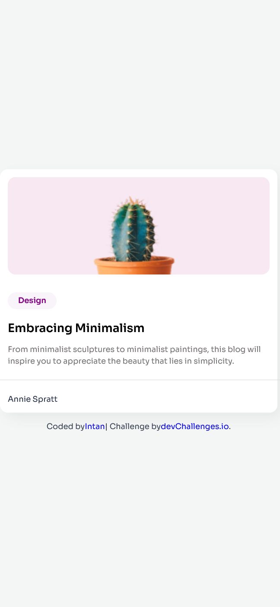
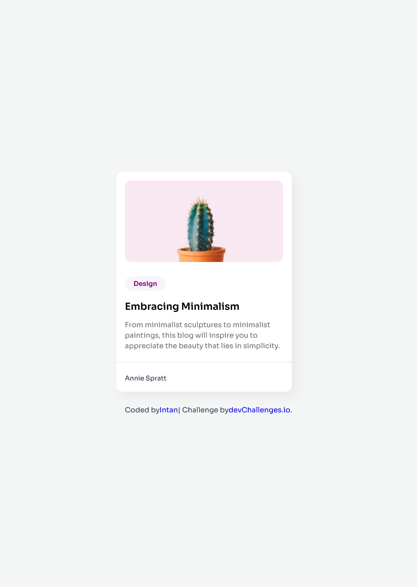

<h1 align="center">Minimal Blog Card | devChallenges</h1>

   Solution for a challenge <a href="https://devchallenges.io/challenge/minimal-blog-card" target="_blank">Minimal Blog Card</a> from <a href="https://devchallenges.io" target="_blank">devChallenges.io</a>.

  <h3>
    <a href="https://intan-demo-minimal-blog-card.vercel.app/">
      Demo
    </a>
     | 
    <a href="https://github.com/intan/minimal-blog-card">
      Solution
    </a>
     | 
    <a href="https://devchallenges.io/challenge/minimal-blog-card">
      Challenge
    </a>
  </h3>

## Table of Contents

- [Overview](#overview)
  - [What I learned](#what-i-learned)
  - [Useful resources](#useful-resources)
- [Built with](#built-with)
- [Features](#features)
- [Author](#author)
- [Acknowledgements](#acknowledgements)

## Overview

This project is a minimal blog card inspired by the devChallenges challenge. It features a clean design, responsive layout, and proper alignment for mobile and desktop.

### What I learned

- How to create a responsive card layout using **HTML & CSS**.
- Using **Flexbox** and **max-width/width percentages** for mobile and tablet.
- Centering elements like author info and buttons using **flex**.
- Proper use of **Google Fonts** and minimalistic design principles.

### Useful resources

- [Google Fonts](https://fonts.google.com/) – for importing 'Sora' font.
- [Flexbox Guide](https://css-tricks.com/snippets/css/a-guide-to-flexbox/) – helped with author-info centering.
- [devChallenges.io Minimal Blog Card](https://devchallenges.io/challenge/minimal-blog-card) – original challenge reference.

### Built with

- Semantic HTML5 markup
- CSS custom properties
- Flexbox
- Responsive design techniques

## Features

- Minimalist blog card design
- Responsive for mobile and tablet
- Image with rounded corners
- Tag with color background
- Author info properly centered
- Horizontal rule separator

## Author

- GitHub: [@intan](https://github.com/intan-ayuuu)

## Acknowledgements

- Thanks to [devChallenges.io](https://devchallenges.io) for the challenge inspiration.
- The design references were taken from the original challenge screenshot.
